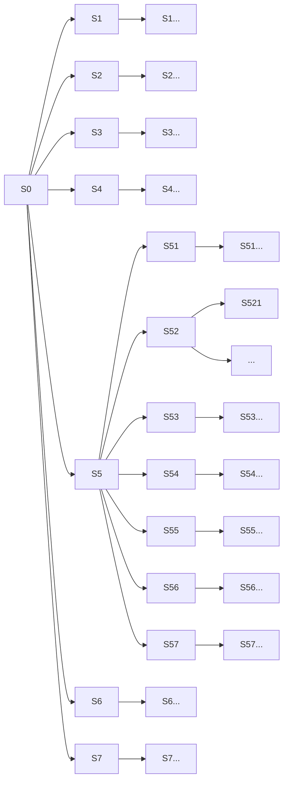

# About the game
You are trying to connect 4 of your tokens in a line on a 7x7 grid by dropping tokens down one of the columns. You compete ad doing this against another player. First player to succeed wins the game.

# About Reinforcement Learning Concepts as applied to the game
## What is the Environment?
The 7x7 grid with the tokens of the players forms the Environment. There are no hidden attributes or random unknowns involved. This is a fully known Environment.

## What are the various states?
Every time a player makes a move this updates the Environment and creates a new state. In this sense there are a lot of different states.

# About Reinforcement Learning Theory as applied to the game
## Markov Chain
The grid does have a limited number of states that can be entered into. As such, we are able to define a fully configured diagram to represent the possible moves between states.

At each of these branches, if there exists a equal weighting of going down each branch. Through this we are able to define a Markov Chain Transition Matrix to define our state space and probabilities of going between the various states.

### Markov Property Note
This is important to note here. This states that the probability of the next state is independent of all previous states -- it just depends on the current state. Expressed mathematically:

$$\mathbb{P}[S_{t+1}|S_t] = \mathbb{P}[S_{t+1}|S_1, ... S_t]$$

Essentially this means that if we have progressed on the above graphic from state S0, where the game starts, to state S5 and then S52, moving forward we don't need to consider S5 anymore we just need note we are in state S52.

## Markov Reward Process
Here we introduce two concepts:
* gamma, g, the discount factor
* R, the reward function

$$\gamma$$
$$\mathscr{R}$$

### Discount Factor
The discount factor varies between [0,1].
A value of 1 indicates that any possible future reward has the same importance as an immediate reward.
A value of 0 indicates that only the reward of the next immediate step matters and no future reward matters.

Thus, in our case above, if we are in state S2 with a discount factor of 0 then only the reward of S21, S22, S23, S24, S25, S26, and S27 need to be considered.
If we had a discount factor of 1, then all the states for 0 and subsequent possible states need to be considered as well.

If we have a discount factor between 0 and 1 then possible rewards that are in the future are not ignored but have diminishing significance the further away the possible state becomes.

#### Application
In our case we want to build an engine with some form of strategy rather than something only considering the next move, but not to count on something so far out in the future as to sacrifice the immediate positions available to the turn. As such, we will want a discount factor between 0 and 1, but this will likely need to be a hyperparameter we tune for performance.

## Markov Decision Process
