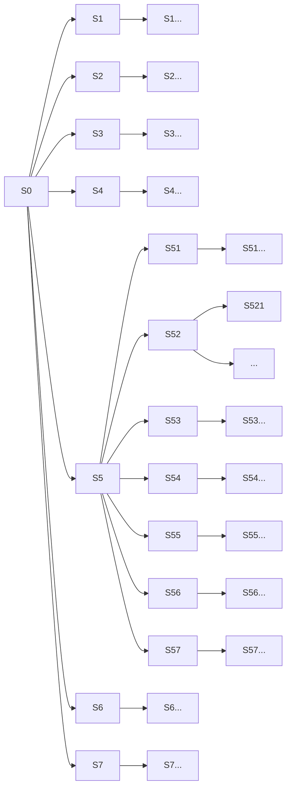

# Overview
## Problem Statement
Design a program that is able to learn how to play the game of Connect 4 without directly programming the actions/strategy of the agent.

## Data
The agent will play games to generate data and learn from these experiences. At first this will be against a random opponent (a random number generator) and then graduate to playing against itself. These games will be the source of the data.

As a result, with proper logging we have already clean, wrangled, and accurate data as we are generating this ourselves as part of the simulations.

Analysis will be based upon the ability to train the agent to be able to beat the opponent. A successful victory on a number of consecutive games will be used to determine success over the opponent.

## Model to Use
This is a reinforcement learning problem and as such, we need to determine one of these models to use. After consideration a deep Q network has been determined to be a viable option.

These 2 articles (
  [here](https://towardsdatascience.com/simple-reinforcement-learning-q-learning-fcddc4b6fe56)
  and
  [here](https://towardsdatascience.com/introduction-to-various-reinforcement-learning-algorithms-i-q-learning-sarsa-dqn-ddpg-72a5e0cb6287)
) were found to be helpful in explaining the concepts of the model.

This was chosen as we wanted to be able to abstract away the policy and minimize the dependency on the environment for our given model. Using a Q-network allows for us to focus on a value based model and not need to determine the policy as well with the deep neural network part of this version allows us to not need to train everything for all possible states and thus abstract away some of this to incorporate into the neural network. As such, this seems like a solid choice.

## Training of Model
As we are training a neural network, this ultimately comes down to defining an error function and doing back propagation through the network to tune the parameters to be ideal for the given network design. Additionally, we need to define a reward function and a few other parameters -- learning rate and discount factor.

As this game is about forming connections between tokens, we are defining a reward function that heavily incentives forming larger connections while penalizing longer connections of the opponent.

# About the game
You are trying to connect 4 of your tokens in a line on a 6x7 grid by dropping tokens down one of the columns. You compete ad doing this against another player. First player to succeed wins the game.

# About Reinforcement Learning Concepts as applied to the game
## What is the Environment?
The 7x7 grid with the tokens of the players forms the Environment. There are no hidden attributes or random unknowns involved. This is a fully known Environment.

## What are the various states?
Every time a player makes a move this updates the Environment and creates a new state. In this sense there are a lot of different states.

# About Reinforcement Learning Theory as applied to the game
## Markov Chain
The grid does have a limited number of states that can be entered into. As such, we are able to define a fully configured diagram to represent the possible moves between states.

At each of these branches, if there exists a equal weighting of going down each branch. Through this we are able to define a Markov Chain Transition Matrix to define our state space and probabilities of going between the various states.

### Markov Property Note
This is important to note here. This states that the probability of the next state is independent of all previous states -- it just depends on the current state. Expressed mathematically:

$$\mathbb{P}[S_{t+1}|S_t] = \mathbb{P}[S_{t+1}|S_1, \dots S_t]$$

Essentially this means that if we have progressed on the above graphic from state S0, where the game starts, to state S5 and then S52, moving forward we don't need to consider S5 anymore we just need note we are in state S52.

## Markov Reward Process
Here we introduce two concepts:
* gamma, the discount factor
* R, the reward function

$$\gamma$$
$$\mathscr{R}$$

### Discount Factor
The discount factor varies between [0,1].
A value of 1 indicates that any possible future reward has the same importance as an immediate reward.
A value of 0 indicates that only the reward of the next immediate step matters and no future reward matters.

Thus, in our case above, if we are in state S2 with a discount factor of 0 then only the reward of S21, S22, S23, S24, S25, S26, and S27 need to be considered.
If we had a discount factor of 1, then all the states for 0 and subsequent possible states need to be considered as well.

If we have a discount factor between 0 and 1 then possible rewards that are in the future are not ignored but have diminishing significance the further away the possible state becomes.

#### Application
In our case we want to build an engine with some form of strategy rather than something only considering the next move, but not to count on something so far out in the future as to sacrifice the immediate positions available to the turn. As such, we will want a discount factor between 0 and 1, but this will likely need to be a hyperparameter we tune for performance.

### Reward Function
This defines the positive or negative impact of each action taken.

This can be further expanded to consider the return for the subsequent actions as well. In this case, we have the reward function result for the next action summed over the reward function of subsequent steps multiplied by increasing multiples of the discount factor.

This can be expressed as (reference Bellman Equation):
$$
\begin{pmatrix}
v(1) \\ \vdots \\ v(n)
\end{pmatrix} = \begin{pmatrix}
R(1) \\ \vdots \\ R(n)
\end{pmatrix} + \gamma \begin{pmatrix}
P_{11} & \dots & P_{n1} \\
\vdots && \vdots \\
P_{1n} & \dots & P_{nn}
\end{pmatrix} \begin{pmatrix}
v(1) \\ \vdots \\ v(n)
\end{pmatrix}
$$
This is something where if these terms are directly able to be defined is solvable, but O(n3) as this involves matrix inversion. As such, typically not practical for complex problems.

Iterative approaches to solve:
* Dynamic programming
* Monte-Carlo evaluation
* Temporal-Difference learning

## Markov Decision Process
This takes the Markov Reward Process and incorporates an action space as well -- allowing for actions to be taken, and the basis for the machine learning part.

The question then becomes what decisions should be made to maximize the reward value down the path, considering the reward function and the discount factor.
This does not typically have a closed form solution and is solved differently.

Some options:
* Iterative solution
  * Value Iteration
  * Polity Iteration
  * Q-learning
  * Sarsa

# Substructure of the game
